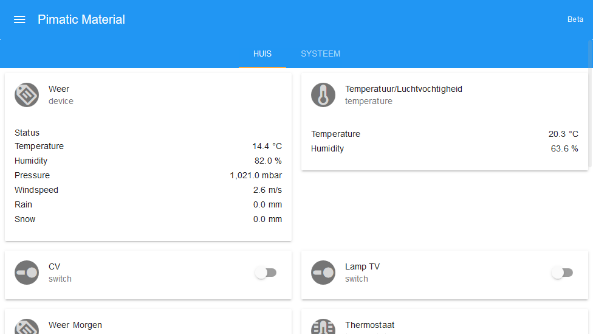

# Pimatic Angular Material Frontend
A web frontend build for the pimatic framework using angular and material design (angular material).

## Configuration
Example configuration:
	
	{
      	"plugin": "angular-material-frontend",
		"mountPoint": "/material",
		"customTitle": "Pimatic Material",
		"debug": false
    }

By default, the webinterface wil be available via `http://<hostname>/material`. You can change this by setting the `mountPoint` option.

If the `debug` setting is set to true, the web app will print additional debug information to the console of the browser.

A screen width of at least 400 pixels is advised, otherwise some buttons will overlap with text.

## Installation
You can install the plugin either via npm or via git.

1. Add the plugin to the plugins section of the `config.json` file of your pimatic app:

	    {
	      "plugin": "angular-material-frontend"
	    }

2. Now you can do one of two steps:
   - Start pimatic. The plugin will be downloaded automatically
   - Install the plugin manually by executing the following command in the pimatic app root:

    		npm install pimatic-angular-material-frontend

		or

			npm install git://github.com/denniss17/pimatic-angular-material-frontend

		This should also automatically download all dependencies via bower. If not, run the following command in the root of the plugin:

    		bower install -p

## Changelog

### 0.2.0
All basic devices (except music player) added.

### 0.1.2
A little bugfix.

### 0.1.1
- Description updated
- Documentation updated

### 0.1.0
Initial release.

## To do
(not in order of priority)

- Add all default templates [link](https://github.com/pimatic/pimatic-mobile-frontend/blob/master/app/views/pages/index.jade)
	- ~~switch~~
	- ~~shutter~~
	- ~~dimmer~~
	- ~~device~~
	- ~~buttons~~ Test many buttons (more than fitting in one row)
    - musicplayer
	- ~~thermostat (GUI settings)~~
	- ~~timer~~
- Error if device could not be found [link](https://github.com/pimatic/pimatic-mobile-frontend/blob/master/app/pages/index-items.coffee#L58)
- Default (device)template if given template does not exist
- Graphs :)
- Edit pages
- Themes
- More settings

## Developing
First make sure all development dependencies are installed:

	npm install

The full source code is available at the git repository. Download the source by cloning the repository.

The application itself is in the `app/` directory. After a change in the application, you should update the file used in the `dev.html` page. This can be done by executing the following command:

	grunt dev

or simply

	grunt

This command wil update the `dist/pimatic-angular-material-frontend.js` file. I recommend creating some kind of file watcher to do this automatically after a file change.

### Testing
Jasmine is used to unit test the frontend. Running the following command should run all tests (all files ending with `.test.js`):

    grunt test

### Building
A Grunt task is specified which should test the scripts and build the production files. Simply run the following command in the project root:

    grunt build

This command will run tests, execute a jshint inspection and update the `dist/pimatic-angular-material-frontend.min.js` and `index.tmpl.html` files.

## References
Pimatic: [http://pimatic.org/](http://pimatic.org/)

Angular: [https://angularjs.org/](https://angularjs.org/)

Angular Material: [https://material.angularjs.org/latest/#/](https://material.angularjs.org/latest/#/)

Jasmine: [http://jasmine.github.io/](http://jasmine.github.io/)

Grunt: [http://gruntjs.com/](http://gruntjs.com/)

Bower: [http://bower.io/](http://bower.io/)

npm: [https://www.npmjs.com/](https://www.npmjs.com/)

This project attempts to follow the AngularJS style guide, which can be found [here](https://github.com/mgechev/angularjs-style-guide).

## License

	Pimatic Angular Material Frontend is published under the GNU General Public License Version 3:
	you can redistribute it and/or modify
	it under the terms of the GNU General Public License as published by
	the Free Software Foundation, version 3.
	
	You should have received a copy of the GNU General Public License
	along with this plugin. If not, see <http://www.gnu.org/licenses/>.
